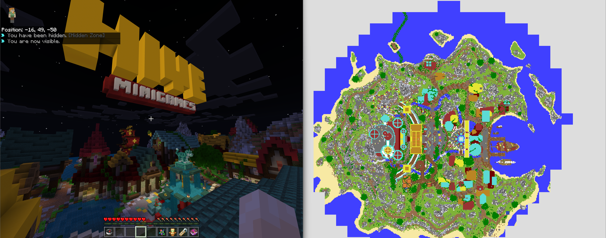

# worldcompute

live-computation, parsing, and saves of minecraft: bedrock servers using gophertunnel and dragonfly.

## usage

download the latest release and move it to its own folder. run the executable and authenticate with xbox live.

when completed, worldcompute will save your xbox live token in the same folder under `token.tok`. unless you delete the
file, you'll be able to use worldcompute without authenticating again.

after authenticating, you can close worldcompute. you'll notice that a configuration will be generated. edit the
configuration to your liking, and then run worldcompute. the worldcompute proxy will now forward connections to the
target server specified.

worldrenderer will automatically run and render the chunks in cache in real-time.

## commands

- `reset` - reset all downloaded chunks in cache.
- `save` - save all downloaded chunks to a folder.
- `cancel` - terminate a save-in-progress.

## supported formats

- `v0` (pre-v1.2.13) (legacy, only used by PM3)
- `v1` (post-v1.2.13, only a single layer)
- `v8/v9` (post-v1.2.13, up to 256 layers) (persistent and runtime)
- `v9 (sub-chunk request system)` (post-v1.18.0, up to 256 layers) (persistent and runtime)

## credits

special thanks to [T 14Raptor](https://github.com/T14Raptor) for his help with the original worldcompute project, and
[Sandertv](https://github.com/Sandertv) for his work on gophertunnel and dragonfly.
